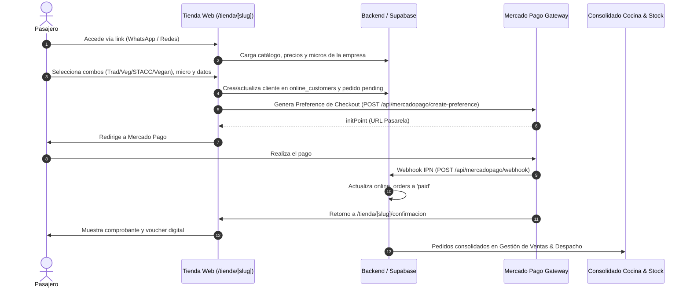

# 📋 ESPECIFICACIÓN FUNCIONAL, TÉCNICA Y ANÁLISIS DE INTEGRACIÓN DE STOCK
## Módulo: Tienda Online de Pasajeros & Mercado Pago
**Super Catering Management System**  
*Fecha: Agosto 2026 | Versión: 2.0 (Producción)*  
*Destinatarios: Equipo de Análisis Funcional, Arquitectura y Desarrollo de Software*

---

## 1. Resumen Ejecutivo y Propósito del Módulo

La **Tienda Online de Pasajeros** es una solución web responsive (con enfoque *Mobile-First*) diseñada para que los pasajeros de las empresas de transporte de recitales y eventos (*RV Traslados*, *ValBus*, *Próxima Estación*, etc.) puedan adquirir de forma anticipada sus viandas y combos gastronómicos para el viaje, abonando directamente mediante **Mercado Pago**.

El objetivo central es:
1. **Descentralizar el cobro individual** de viandas a los pasajeros.
2. **Automatizar la liquidación comercial** y comisiones por empresa/evento.
3. **Centralizar la demanda para Cocina y Logística** en un consolidado único.

---

## 2. Arquitectura Funcional y Flujo End-to-End

### 2.1. Experiencia de Usuario (UX / Frontend)
* **Acceso Simple:** URLs amigables autogeneradas (ej: `/tienda/arcangel-rv-traslados-2026-08-28`).
* **Selector Visual de Menús:** Grilla interactiva 2x2 con botones de cantidad táctiles (+ / -) y subtotalización en vivo:
  * 🥪 Combo Tradicional
  * 🥗 Combo Vegetariano
  * 🌾 Combo Sin TACC (con advertencia de cupo)
  * 🌱 Combo Vegano
* **Asignación de Logística:** Selección de fecha de viaje y micro/unidad de traslado (filtrado estrictamente por la empresa organizadora).
* **Barra de Checkout Flotante:** Carrito sticky con monto total en ARS y botón directo de pago.

### 2.2. Integración Mercado Pago (API & Webhooks)
* **SDK:** `@mercadopago/sdk-react` y SDK Node oficial.
* **Modo:** Checkout Pro con redirección segura y `back_urls` dinámicas basadas en el host activo.
* **Webhook de Notificación:** Endpoint `/api/mercadopago/webhook` que recibe los eventos `payment.created` / `payment.updated`, valida el estado de la transacción y transiciona el pedido de `pending_payment` a `paid`.

---

## 3. Matriz de Reglas de Negocio Comerciales por Empresa

| Empresa | Canal | Precio Base (Trad/Veg/Vegan) | Precio Sin TACC | Agua Mineral | Política de Liberados | Comisiones |
| :--- | :--- | :---: | :---: | :---: | :--- | :--- |
| **RV Traslados** | Minorista (Online) | **$10.000** | **$13.000** (Fijo) | Incluida | • <10% Pax: 0 • 10%-29%: 1 vianda • ≥30%: 3 viandas • Agua liberados: solo si ≥50% Pax | • $1.000 / vianda a Coordinador • Bonus $10.000 si ≥70% Pax |
| **ValBus** | Minorista (Online) | **$8.500** | **$10.000** (Fijo) | Incluida | • <10% Pax: 0 • ≥10% Pax: 1 vianda + 1 agua x coche (Solo Chofer) | • Sin Coordinador ($0) |
| **Próxima Estación** | Combo (Online) | **$10.000** | **$13.000** (Fijo) | Incluida | • <10% Pax: 0 • 10%-29%: 1 vianda • ≥30%: 3 viandas • Agua liberados: solo si ≥50% Pax | • $1.000 / vianda a la Empresa • Sin bonus al 70% |
| **Rock en las Venas** | Mayorista (B2B) | **$7.000** | **$10.000** (Excedente) | Incluida | • Fijo: Chofer/es + Coordi (1 a 3 x micro) | Paquete cerrado |
| **Terco Tour** | Mayorista (B2B) | **$6.000** | **$10.000** (Excedente) | **Sin Agua ($0)** | • Fijo: Chofer/es + Coordi (1 a 3 x micro) | Paquete cerrado |

> [!IMPORTANT]
> **Regla de Oro Sin TACC:** En todas las empresas, las viandas Sin TACC **NUNCA pueden formar parte de las viandas liberadas/bonificadas**. Si un evento tiene viandas liberadas, estas se absorben obligatoriamente de las líneas comunes (Tradicional, Vegetariana o Vegana).

---

## 4. Modelo de Datos y Entidades en Supabase

### 4.1. `online_store_events` (Configuración de la Tienda)
* `id` (UUID, PK)
* `event_master_id` (UUID, FK -> `events_master.id`)
* `slug` (TEXT, UNIQUE): Identificador en la URL pública.
* `title`, `subtitle`, `description`, `banner_image_url` (TEXT)
* `sales_deadline` (TIMESTAMPTZ): Fecha y hora límite para comprar.
* `available_dates` (TEXT[]): Fechas de viaje habilitadas.
* `combo_*_enabled` (BOOLEAN) y `combo_*_price` (NUMERIC) por variedad.
* `is_active` (BOOLEAN): Switch maestro de publicación.

### 4.2. `online_orders` (Transacciones de Pasajeros)
* `id` (UUID, PK)
* `store_event_id` (UUID, FK -> `online_store_events.id`)
* `customer_id` (UUID, FK -> `online_customers.id`)
* `travel_date` (DATE) y `bus_identifier` (TEXT)
* `qty_tradicional`, `qty_vegetariano`, `qty_sintacc`, `qty_vegano` (INTEGER)
* `price_*_unit` y `total_amount` (NUMERIC)
* `status` (TEXT: `'pending_payment'`, `'paid'`, `'cancelled'`, `'refunded'`)
* `mp_preference_id`, `mp_payment_id`, `mp_status` (TEXT)
* `synced_to_header_id` (UUID, FK -> `event_sales_headers.id`)

### 4.3. `online_customers` (Base CRM de Pasajeros)
* `id` (UUID, PK)
* `email` (TEXT, UNIQUE), `full_name` (TEXT), `phone` (TEXT), `dni` (TEXT)
* `total_orders` (INTEGER), `total_spent` (NUMERIC)

---

## 5. Diagnóstico de Integración con el Sistema de Stock

> [!WARNING]
> **Respuesta a la pregunta central:**  
> ¿Está actualmente la Tienda Online integrada en tiempo real con el stock para impedir vender más de lo disponible?  
> **Diagnóstico Actual: Integración Asíncrona (Post-Venta / Producción). NO existe bloqueo de cupo en tiempo real (*Hard Cap*) en el checkout.**

### 5.1. ¿Cómo se descuenta el Stock actualmente?
1. **Motor de Stock por Deltas (`syncStockForSaleAction`):**  
   El descuento de materia prima e insumos (panes, jamón, queso, milanesas, viandas Sin TACC selladas, aguas) se ejecuta cuando el operador ingresa a **Ventas por Evento** (`/ventas-evento`) y consolida la venta de los micros, o cuando se cierra el **Consolidado de Cocina** (`/produccion`).
2. **Explosión de Recetas:** El sistema cruza cada vianda contra la tabla `recetas` e `receta_insumos`, aplica el `factor_merma` (rinde) del producto y registra los movimientos en `stock_movements` con signo negativo.

### 5.2. Puntos Fuertes Actuales
* **Corte por Fecha Límite (`sales_deadline`):** La tienda bloquea automáticamente nuevas compras si se supera el horario límite fijado para la producción de cocina.
* **Trazabilidad de Pasajeros:** Cada pedido pagado queda perfectamente registrado con su número de micro y celular.
* **Modelo Make-to-Order Flexible:** Permite ajustar compras de insumos según la demanda real acumulada en preventa.

### 5.3. Brechas Identificadas y Riesgo de Sobreventa (*Overselling*)
1. **Sin Tope de Stock por Menú (Sin TACC / Vegano):** Las viandas Sin TACC suelen comprarse a proveedores especializados con stock limitado. Hoy un pasajero puede comprar 20 Sin TACC en la tienda aunque Cocina solo tenga 5 disponibles.
2. **Sin Límite por Capacidad de Coche:** Si un micro tiene 50 asientos, la tienda hoy permite que 65 personas elijan ese mismo micro si compran online.
3. **Descuento de Stock no Inmediato:** El stock de insumos no se reserva en `stock_movements` al momento exacto en que Mercado Pago aprueba el pago, sino cuando el operador abre y guarda la venta del evento.

---

## 6. Plan de Acción y Recomendaciones para Análisis Funcional y Programación

Para lograr un control estricto de cupos y prevenir sobreventas al 100%, se recomienda implementar las siguientes mejoras en la siguiente iteración:

### Fase 1: Cupos Máximos por Menú en la Tienda (*Hard Caps*)
1. **Campos de Cupo en `online_store_events`:**
   * `max_stock_tradicional` (INTEGER, null = ilimitado)
   * `max_stock_sintacc` (INTEGER, ej: 10 unidades máx)
   * `max_stock_vegano` / `max_stock_vegetariano`
2. **Cálculo de Disponibilidad en Tiempo Real:**
   $$\text{Stock Disponible} = \text{Cupo Máximo} - \sum (\text{Pedidos con status = 'paid'})$$
3. **UI / Selector Bloqueado:**
   Si $\text{Stock Disponible} \le 0$, el selector de cantidad queda deshabilitado en 0 y muestra una insignia roja de **"AGOTADO"**.

### Fase 2: Reserva Inmediata de Stock vía Webhook
* Modificar `/api/mercadopago/webhook` para que, ante un evento `approved`, genere automáticamente un movimiento de stock de tipo `RESERVA_ONLINE` en `stock_movements`, garantizando que el stock físico quede comprometido al instante.

### Fase 3: Límite de Asientos por Micro
* Conectar el campo de selección de micro con `vehicles.capacity` para que cuando un micro alcance su capacidad total de pasajeros, se oculte del selector de la tienda o pase al estado *"Coche Completo"*.

---

## 7. Conclusión

El módulo de **Tienda Online + Mercado Pago** se encuentra **100% operativo y robusto para la recaudación, categorización de menús y liquidación por empresa**. 

Para cerrar el circuito con **Control de Stock y Disponibilidades en Vivo**, la base de datos y la arquitectura ya están preparadas para incorporar los **Cupos Máximos por Menú (Fase 1)** con un esfuerzo técnico mínimo.
